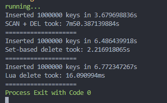
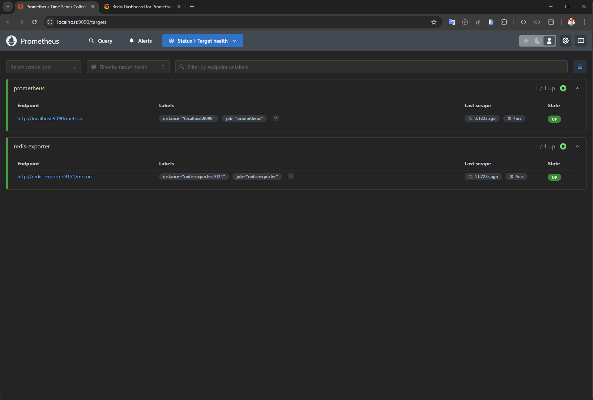
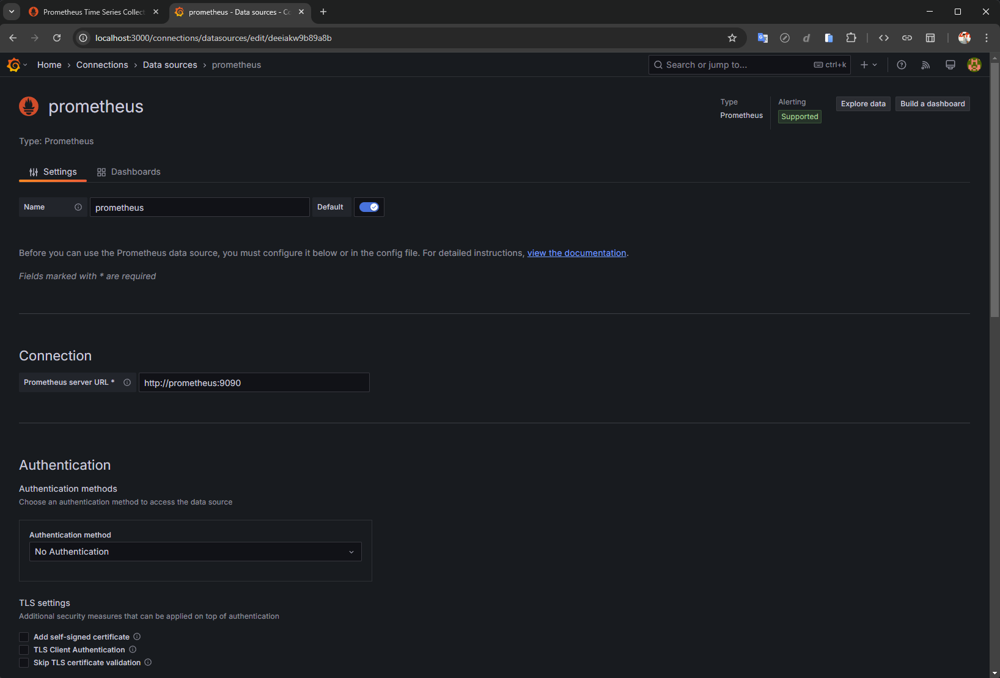
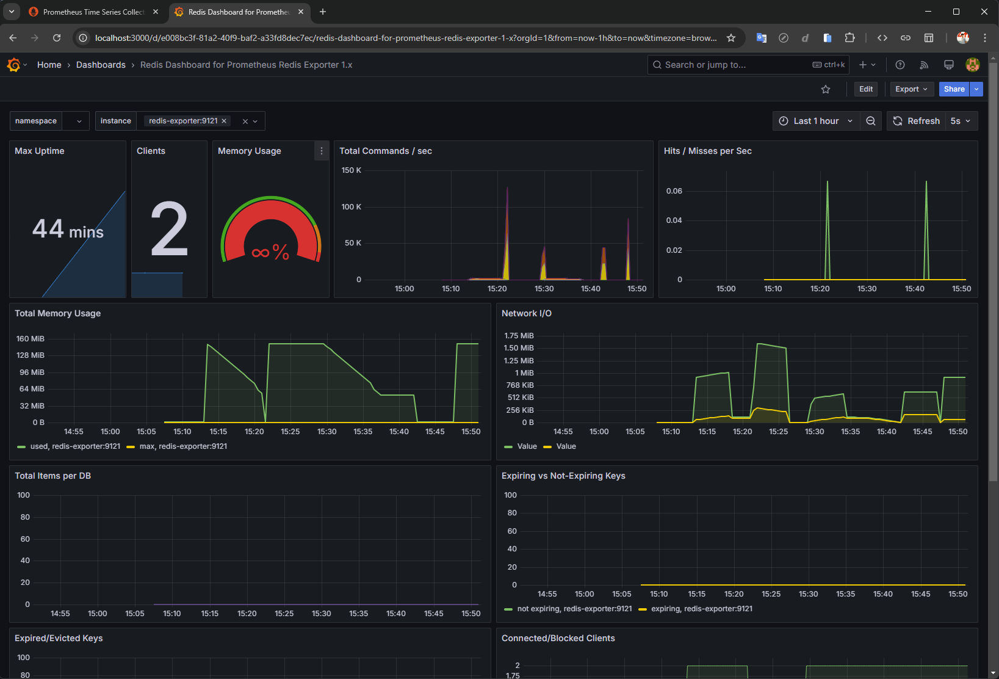

## 🔥 Conclusion

In conclusion, the performance of different deletion methods in Redis varies significantly:

- **SCAN + DEL** → ❌ Inefficient and slow
- **Set-based tracking** → ✅ Efficient and fast
- **Lua script deletion** → ⚡ Highly efficient and the fastest

## 📊 Expected Performance

| Method       | Expected Time          | Why?                          |
| ------------ | ---------------------- | ----------------------------- |
| SCAN + DEL   | Slow (seconds-minutes) | Iterates & deletes one by one |
| Set Tracking | Fast (~ms)             | Deletes all keys in bulk      |
| Lua Script   | Fastest (~ms)          | Executes inside Redis, atomic |

## Result

## Check status of Prometheus and Redis Exporter

- **Go to** → http://localhost:9090/targets

## Visit Grafana Dashboard

- **Go to** → http://localhost:3000
- **User:** `admin`
- **Password:** `admin`

--- 

### Add datasource

- **Enter** → `http://prometheus:9090`
- **Click Test and Save button**

### Import dashboard

- **Enter** → `763`
- **Click load button**
- **Select** → `prometheus datasource`

